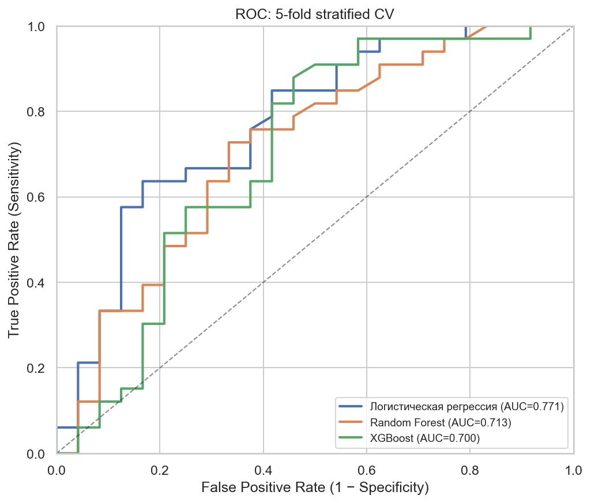

# Сводка: ML-модели vs клиническое исследование

Сравнение результатов PoC (папка `susana_release`) с данными из статьи — проспективное когортное исследование ПОД у детей 2–12 лет.

---

## 1. Данные и фильтрация

Применены **критерии включения из протокола исследования**:

| Шаг | Исключено | Осталось |
|-----|-----------|----------|
| Исходный CSV | — | 65 |
| Дубликаты | 2 | 63 |
| Возраст <2 или >12 лет | 6 | **57** |
| ASA > III | 0 | **57** |

Отфильтрованная выборка: **`PRODETI_RISK_2-12_filtered.csv`**

| Параметр | Клиническое исследование | ML PoC (после фильтрации) |
|----------|-------------------------------------|---------------------------|
| n | **56** | **57** (+1 к публикации) |
| ПОД, n (%) | **31 (55,4%)** | **33 (57,9%)** |
| Возраст, медиана [IQR] | 8,0 [5,0; 10,0] | 8,0 [5,0; 10,0] |
| Длит. анестезии, медиана [IQR] | 25,0 [20,0; 30,0] | 25,0 [20,0; 30,0] |
| m-YPAS, медиана [IQR] | 30,0 [28,0; 35,0] | 30,0 [28,0; 35,0] |
| Опиоиды, n (%) | 11 (19,6%) | 12 (21,1%) |

**Примечание:** после фильтрации n=57 (на 1 больше публикации). Распределения медиан совпадают; расхождение по n и числу случаев ПОД (+2) — вероятно лишние строки в `данные.numbers`, не попавшие в финальную когорту статьи.

---

## 2. Клинические предикторы

### Из статьи

| Фактор | Результат авторов |
|--------|-------------------|
| **Длительность анестезии** | q=0,002; OR 1,07/мин (95% ДИ 1,02–1,13) |
| **Поведение при индукции** | q=0,007; кат. 3 vs 1: OR 14,2 (2,6–78,1) |
| **Тип операции** | q=0,027; наибольший риск при ЛОР |
| **Использование опиоидов** | OR 12,1 (1,3–113,0) в многофакторной LR |

### Наши ML-модели (после фильтрации)

| Признак | Доля важности (LR, \|β\|) | Согласование |
|---------|---------------------------|--------------|
| **Длительность анестезии** | **#1 (23,8%)** | ✅ |
| **Поведение при индукции** | **#2 (22,4%)** | ✅ |
| **План. длительность** | #3 (11,8%) | ✅ |
| **Тип операции** | #4 (9,6%) | ✅ |
| **Опиоиды** | #9 (1,7%) | ⚠️ Слабый вклад в деревьях; в LR авторов OR 12,1 |

---

## 3. Дискриминационная способность (AUC)

| Модель / подход | AUC | 95% ДИ | Sensitivity | Specificity |
|-----------------|-----|--------|-------------|-------------|
| **Многофакторная LR (авторы)** | **0,83** | **0,72–0,94** | **71%** | **76%** |
| **LR, 5-fold CV (фильтр.)** | **0,771** | **0,638–0,887** | 67% | 63% |
| Random Forest, 5-fold CV | 0,713 | 0,571–0,848 | 67% | 67% |
| XGBoost, 5-fold CV | 0,700 | 0,545–0,836 | 58% | 63% |

### Интерпретация

1. **AUC LR = 0,771** — ниже точечной оценки авторов (0,83), но **95% ДИ перекрываются** (0,64–0,89 vs 0,72–0,94).
2. После фильтрации (n=57, 33 события ПОД) метрики **ниже**, чем на полной выборке (AUC было 0,841) — ожидаемо при удалении 8 наблюдений и изменении баланса классов.
3. **LR остаётся лучшей моделью** по CV, что согласуется с подходом авторов (многофакторная логистическая регрессия).
4. Hold-out (n=12 тест) нестабилен — для отчёта используем **5-fold CV**.

---

## 4. Матрица ошибок (LR, 5-fold CV)

|  | Pred 0 | Pred 1 |
|--|--------|--------|
| **True 0** | 15 | 9 |
| **True 1** | 11 | 22 |

Accuracy 64,9%, F1 0,688.

---

## 5. Сравнение: до и после фильтрации

| | Без фильтра (n=65) | **С фильтром (n=57)** | Авторы (n=56) |
|--|---------------------|------------------------|---------------|
| ПОД, % | 55,4% | **57,9%** | 55,4% |
| LR AUC (CV) | 0,841 | **0,771** | 0,830 |
| LR Sens / Spec | 69% / 76% | **67% / 63%** | 71% / 76% |
| Топ-1 предиктор | Длит. анестезии | **Длит. анестезии** | Длит. анестезии |
| Топ-2 предиктор | Поведение при индукции | **Поведение при индукции** | Поведение при индукции |

---

## 6. Итоговый вывод

**После фильтрации по критериям исследования (возраст 2–12, без дубликатов) лучшая модель — логистическая регрессия (AUC = 0,771; 95% ДИ 0,638–0,887).** Ключевые предикторы — **длительность анестезии** и **поведение при индукции** — полностью совпадают с многофакторной моделью из статьи. AUC несколько ниже точечной оценки авторов, но доверительные интервалы перекрываются; расхождение может быть связано с n=57 vs n=56 в публикации.

---

## 7. Ограничения

- n=57 vs n=56 в статье — требует уточнения у заказчика.
- Малый объём — метрики нестабильны.
- PoC не является клинической рекомендацией.

---

## Артефакты

| Ресурс | Путь |
|--------|------|
| Отфильтрованные данные | `PRODETI_RISK_2-12_filtered.csv` |
| Notebook | `pod_delirium_poc.ipynb` |
| Метрики JSON | `reports/model_metrics.json` |
